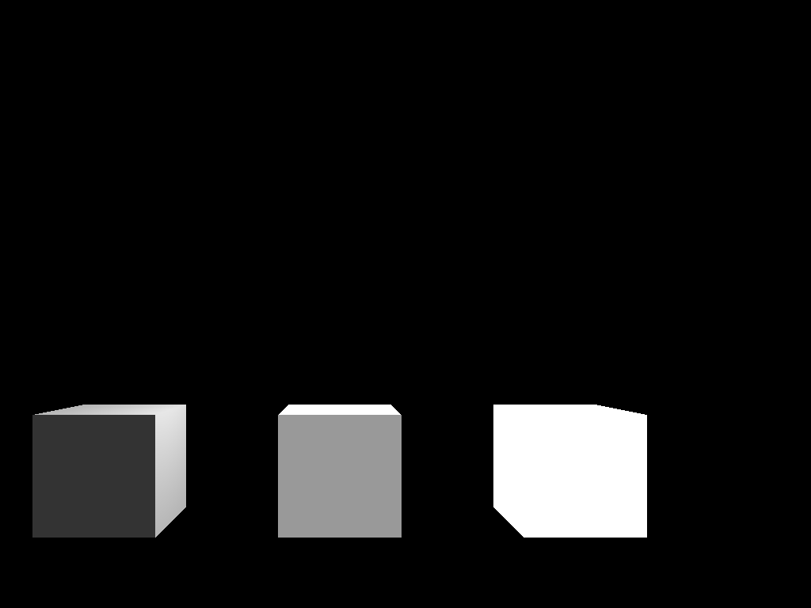
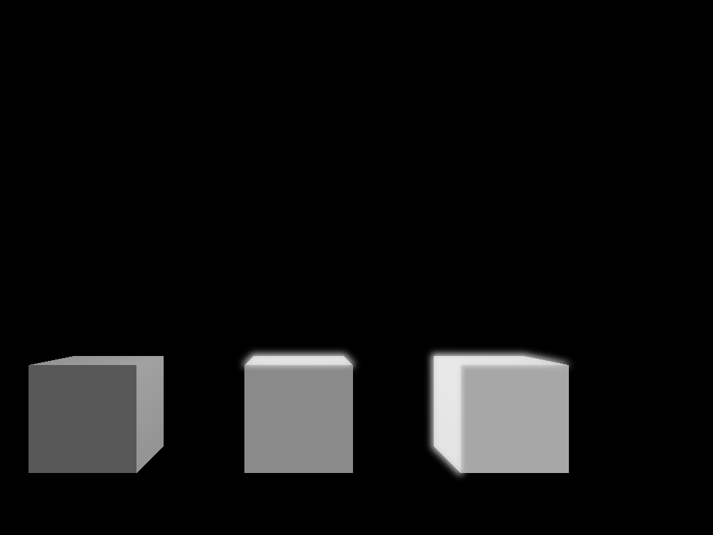

## Project 6: 

# Screen Bloom
Test case for screen bloom:
Scene with 3 cubes, with ambient coefficients of .2, .6, and 1 from left to right.

This test case shows how the blur is picked up at a given threshold, and applied over the base scene.

# Crepuscular Rays

### Design Choices
For bloom, I followed the steps laid out in this OpenGL tutorial: https://learnopengl.com/Advanced-Lighting/Bloom. 
For crepuscular rays, I used the fragment shader given in https://developer.nvidia.com/gpugems/gpugems3/part-ii-light-and-shadows/chapter-13-volumetric-light-scattering-post-process, and used FBO layering to separate the logic. 

### Collaboration/References
NA

### Known Bugs
Godrays rendering to defaultFBO in a 2x2 grid...

### Extra Credit
NA
